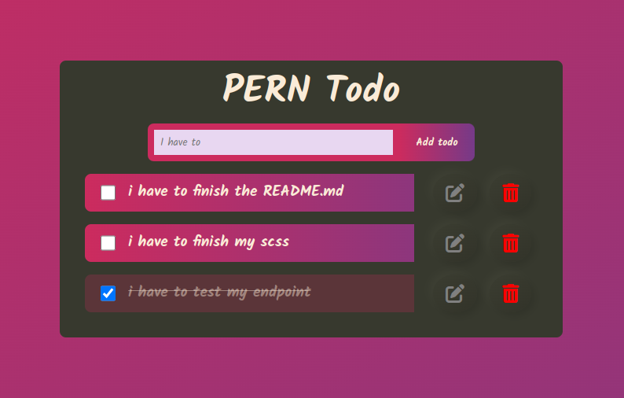

# PERN TODO

Simple to-do application made with PERN stack, PostgreSQL, Express, React and NodeJS



## Software packages :

to run this application on your local server you need:

- yarn and npm
- PostgreSQL
- NodeJs
- React
- Express

## PostgreSQL Configuration :

- Clone this repository or download the zip file
- Create a database called "todopern"
- Create a table inside this database called "todo" with the schema given in database.sql file present in the server folder
- rename the folder db.dist db.js
- In db.js add your PostgreSQL user and password

## run the app

- Open this repo on your code editor and cd into server folder and run the following command in the terminal :

```
    npm install
```

```
    nodemone index
```

- Open another terminal and cd into client folder and run the following command :

```
    yarn   
```

```
    yarn start
```
